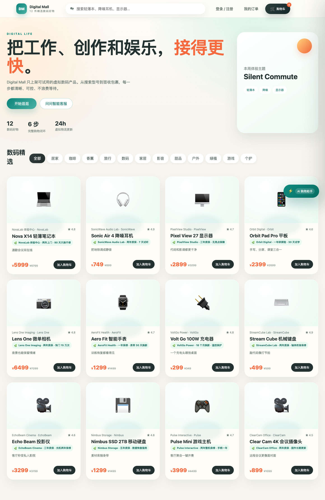
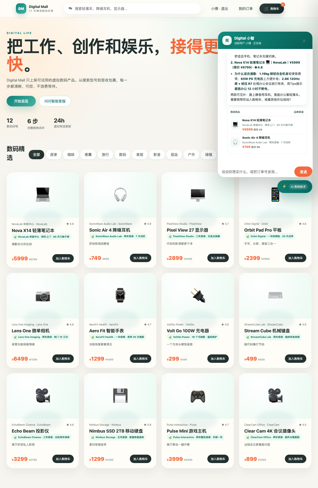
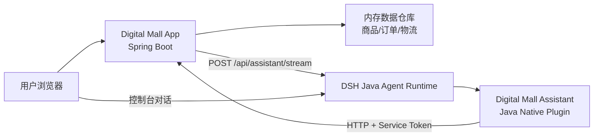

# Digital Mall · P1 虚拟数码商城

基于 [DSH Java](https://dsh-java.xiaofuge.cn/) 的完整场景案例：一个 PC 端虚拟数码商城 + Java Native 插件。业务应用提供商品、购物车、订单、支付和物流；DSH 插件把这些能力注册成 Agent 工具，让 AI 基于真实接口推荐商品、查询订单和解释物流。

## 服务地址

- 商城：<http://127.0.0.1:18080>
- DSH 控制台：<http://127.0.0.1:8090>
- 演示账号：`customer-1 / 123456`

当前服务在本机验证通过，插件 `digital-mall-assistant` 已安装激活。长驻服务可能被回收；重启商城可执行：

```bash
java -jar digital-mall-app/target/digital-mall-app-1.0.0-SNAPSHOT.jar --server.port=18080
```

重启 DSH 可使用技能脚本 `bash /Users/fuzhengwei/.codex/skills/dsh-java-plugin-skills/scripts/start_harness.sh`。内存数据重启后会还原种子状态。

## 项目效果






## 功能闭环

1. 浏览 12 件数码商品，支持分类筛选和关键字搜索。
2. 登录后加入购物车、调整数量、结算下单。
3. 使用虚拟微信/支付宝/银行卡完成支付。
4. 查看订单列表、订单详情、支付状态和物流轨迹。
5. 在页面右下角打开 AI 购物助手，直接提问推荐、对比、订单和物流。
6. 在 DSH 控制台使用同一个插件工具集进行 Agent 对话。

## 体验流程

### 1. 商城页面

1. 打开 <http://127.0.0.1:18080>，先看首页商品和分类胶囊。
2. 使用 `customer-1 / 123456` 登录。
3. 选择一款商品加入购物车，进入结算和虚拟支付。
4. 打开“我的订单”，点击“查看物流”。

### 2. 应用内 AI 助手

点击右下角“AI 购物助手”，可以问：

```text
推荐两款适合通勤的数码产品，并说明为什么。
```

```text
查一下我的订单列表，并总结状态。
```

```text
帮我查一下订单 MD20260923001025 的物流。
```

页面会把消息代理到 DSH `/api/assistant/stream`，Agent 再调用插件工具回源商城 API。回答中的商品、价格、订单和物流都不是模型记忆，而是工具返回。

### 3. DSH 控制台

打开 <http://127.0.0.1:8090>，进入 Agent 对话，使用带上下文的问题：

```text
[商城上下文] customerId=customer-1
帮我查一下订单 MD20260923001025 的物流。
```

DSH 会看到形如 `plugin__digital-mall-assistant__query_logistics` 的工具，并在 `step_break` / `tool_result` 中返回真实调用轨迹。

## 插件工具

| 暴露到 Agent 的工具 | 能力 | 已验证 |
|---|---|---|
| `plugin__digital-mall-assistant__search_products` | 关键词/分类搜索商品 | ✅ “通勤”推荐实测 |
| `plugin__digital-mall-assistant__get_product` | 查询商品详情 | ✅ `p002` 实测 |
| `plugin__digital-mall-assistant__query_orders` | 查询当前用户订单列表 | ✅ `customer-1` 实测 |
| `plugin__digital-mall-assistant__get_order` | 查询订单明细 | ✅ 服务凭证链路实测 |
| `plugin__digital-mall-assistant__query_logistics` | 查询物流轨迹 | ✅ `MD20260923001025` 实测 |

插件配置：

```json
{
  "mall.base-url": "http://127.0.0.1:18080",
  "mall.service-token": "mall-internal-demo-token"
}
```

修改配置后需要停用再启用插件，让 `configure(PluginContext)` 重新执行。

## 本地运行

### 1. 环境要求

- JDK 17+
- Maven 3.9+
- 本机 18080、8090 端口空闲

### 2. 构建

```bash
mvn clean package -DskipTests
```

### 3. 启动商城

```bash
java -jar digital-mall-app/target/digital-mall-app-1.0.0-SNAPSHOT.jar --server.port=18080
```

> 一定要显式传 `--server.port`，避免环境里的 `SERVER_PORT` 抢占配置。

### 4. 启动 DSH

```bash
bash /Users/fuzhengwei/.codex/skills/dsh-java-plugin-skills/scripts/start_harness.sh
```

### 5. 安装插件

```bash
bash /Users/fuzhengwei/.codex/skills/dsh-java-plugin-skills/scripts/install_plugin.sh \
  "$PWD/digital-mall-plugin/target/digital-mall-plugin-1.0.0-SNAPSHOT.jar" \
  digital-mall-assistant \
  1.0.0-SNAPSHOT \
  digital-mall-plugin-1.0.0-SNAPSHOT.jar \
  "Digital Mall Assistant"
```

然后到 DSH 插件配置中保存上面的 `mall.base-url` 和 `mall.service-token`，停用并重新激活插件。

## 架构



- `digital-mall-app`：Spring Boot 3.3.2 业务应用，提供 REST API 和原生 HTML/CSS/JS 前端。
- `digital-mall-plugin`：DSH Java Native 插件，通过 SPI 加载，注册 5 个工具。
- 插件不直连数据存储，只通过 HTTP + `X-Service-Token` 调用商城 API，保住业务校验边界。

## 项目结构

```text
digital-mall-app/        # 商城后端 + 前端
digital-mall-plugin/     # DSH Java Native 插件
docs/DESIGN.md           # 设计说明与架构
docs/images/             # 运行截图
docs/DELIVERY.md         # 验收记录
```

## 验证记录

- `mvn clean package -DskipTests`：通过。
- DSH 探活：`http://127.0.0.1:8090`，HTTP 200。
- 商城探活：`http://127.0.0.1:18080`，HTTP 200。
- 插件状态：`digital-mall-assistant ACTIVE`。
- 商城链路：登录、加购、下单、支付、订单详情、物流轨迹均通过。
- Agent 链路：商品推荐、商品详情、订单列表、订单详情、物流轨迹均通过工具实测。
- 应用代理链路：`POST /api/assistant/stream` 流式输出通过。

## 预置数据

- 商品：Nova X14 轻薄笔记本、Sonic Air 4 降噪耳机、Pixel View 27 显示器、Orbit Pad Pro 平板、Lens One 微单相机、Aero Fit 智能手表等 12 件。
- 用户：`customer-1`，昵称“小傅”。
- 订单/物流：可通过页面下单生成；支付后自动生成虚拟轨迹和取件码。

## 简历项目描述

**Digital Mall · DSH Java 场景案例（P1 虚拟数码商城）**

- 基于 Java 17 + Spring Boot 3 构建虚拟数码商城，完成商品搜索、购物车、下单、模拟支付、订单和物流履约闭环。
- 使用 DSH Java Native Plugin 机制开发智能购物助手插件，通过 SPI 注册 5 个 Agent 工具，让模型基于业务 API 推荐商品、查询订单和解析物流。
- 设计插件-应用 HTTP 边界与 `X-Service-Token` 服务间鉴权，插件只做能力适配，不直连数据资源，避免业务规则和数据外泄。
- 实现应用内 SSE AI 面板，将用户消息代理到 DSH Agent，流式渲染工具调用结果；商品推荐、订单查询和物流解释全链路实测通过。
- 输出项目 README、架构图、截图、简历描述和面试要点，形成可复用的 DSH 场景案例模板。

## 面试要点

1. **为什么要用插件而不直接让模型查库？**  
   插件在 Agent 与业务系统之间建立能力适配层；业务应用保留鉴权、校验和数据所有权，模型只能调用受控工具。
2. **如何避免 AI 编造商品和价格？**  
   插件系统提示词强制商品类问题必须调用 `search_products` / `get_product`，价格、库存、订单、物流只允许来自工具结果。
3. **Java Native Plugin 的加载流程是什么？**  
   `plugin.yaml` 描述插件，SPI 声明实现类，DSH 加载 JAR 后调用 `tools()` 注册工具，`configure()` 读取配置、注册系统提示词和 Hook。
4. **服务间安全怎么做？**  
   插件请求商城时携带 `X-Service-Token`；商城过滤器校验凭证，插件不持有数据库或敏感资源凭据。
5. **前端 AI 面板怎么处理流式输出？**  
   使用 `fetch` 读取 SSE `chunk` 事件，逐块更新气泡，并用轻量 Markdown 渲染器输出标题、列表、加粗和表格。
6. **工具为什么要带 `customerId`？**  
   Agent 不知道页面登录态，应用会在请求前注入 `[商城上下文] customerId`；插件用它回源查询，业务层仍会校验订单归属。
7. **为什么用内存数据？**  
   演示场景要保证零数据库依赖、快速启动和可重复验收；重启即还原种子数据，便于反复验证写操作。
