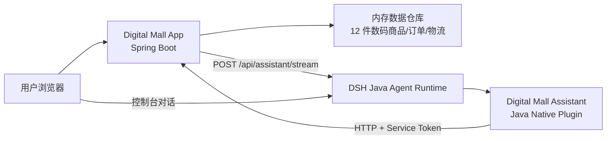

# Digital Mall 设计说明

## 产品定位

Digital Mall 是一个 PC 端虚拟数码商城，围绕“看得清参数、比得出差异、查得到履约”的购物体验展开。项目不是把 AI 挂在页面角落，而是让商品、订单、物流三类数据全部进入 Agent 工具体系，AI 可以基于真实接口回答。

## 业务闭环

1. 商品搜索：关键字匹配名称、品牌、分类、标签、描述和渠道。
2. 商品详情：提供参数、库存、评分、选购建议和服务保障。
3. 购物车：演示用户登录后可加购、修改数量、删除商品。
4. 下单支付：生成订单、模拟微信/支付宝/银行卡支付。
5. 订单查询：支持订单列表、订单详情和状态追踪。
6. 物流轨迹：支付后自动生成承运商、节点、预计送达和取件码。

## 架构

商城保留业务校验与数据所有权；插件只做能力适配，不复制业务规则，也不直接持有商品、订单或物流数据。Agent 的每次推荐都必须回到商城接口查证。

## 插件边界

插件 ID：`digital-mall-assistant`。注册工具：

| 工具 | 何时调用 | 返回 |
|---|---|---|
| `search_products` | 推荐、对比、分类、库存、价格问题 | 商品摘要列表 |
| `get_product` | 已知商品 ID 或需要完整参数 | 商品详情 |
| `query_orders` | 查订单列表或当前用户履约状态 | 订单列表 |
| `get_order` | 已知订单号，需要明细/金额/地址 | 订单详情 |
| `query_logistics` | 已知订单号，查轨迹/预计送达/取件码 | 物流轨迹 |

插件通过 `registerSystemPrompt` 限制：只使用工具返回的数据、不虚构品牌、不编造价格和库存、订单/物流必须带 `[商城上下文] customerId`。`POST_TOOL_USE` 会发布 `digital-mall-assistant.tool.used` 审计事件。

## 界面设计语言

- 主色：石墨蓝 `#1D2B36`，用于品牌和导航，体现数码质感。
- 强调色：电路青 `#0FA3A3`，聚焦关键操作与状态。
- 背景材质：浅灰底上的细网格，呼应参数面板和工程屏幕。
- 标志性元素：直角卡片 + 参数徽标 + 商品 emoji 载体。
- AI 面板：右下角浮动入口，侧滑流式输出，Markdown 渲染。

## 数据策略

演示环境使用内存数据，重启即还原种子数据，适合快速体验和自动化测试。种子数据包含 12 件数码商品、一个演示用户、既有订单状态和物流节点，避免“商品 A/订单 A”这类占位内容。
